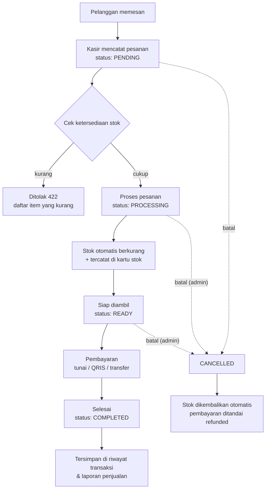
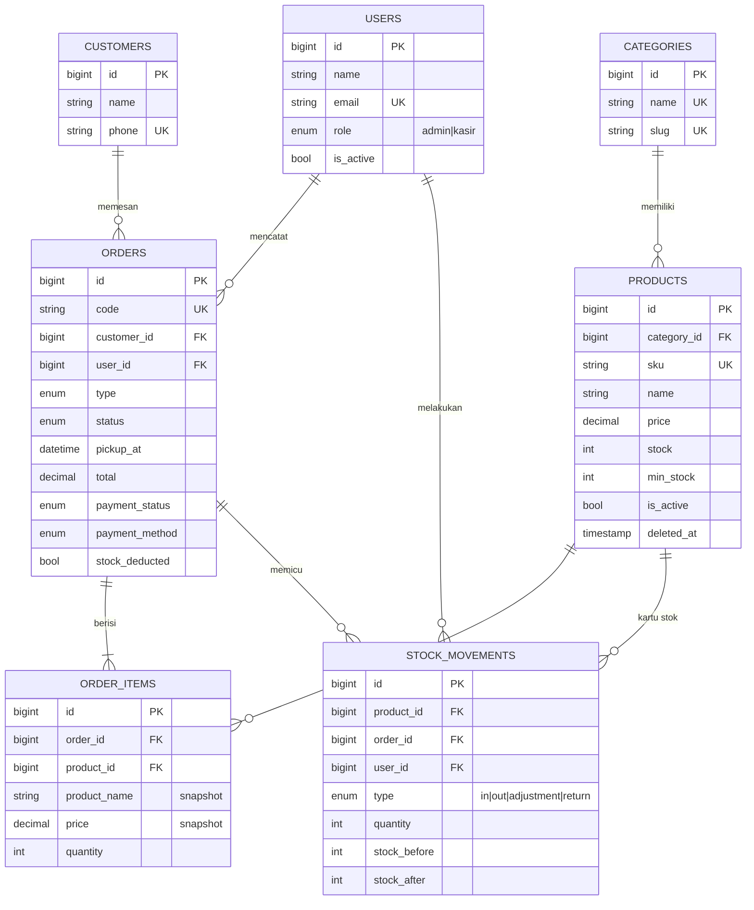

# KasirKita — Sistem POS Kasir Kedai Kopi & Roti

Aplikasi **POS (Point of Sale)** berbasis **Laravel 13 + MySQL + Sanctum** untuk kedai kopi & toko roti skala UMKM.
Backend berupa **RESTful API** (Bearer token Sanctum), frontend memakai **Blade + HTML/CSS/JavaScript** yang mengonsumsi API tersebut.

## Permasalahan yang diselesaikan

Kedai kopi & roti kecil di sekitar kampus umumnya mencatat pesanan di kertas/chat WhatsApp. Akibatnya:

1. **Stok tidak sinkron** — roti/kopi habis tetapi masih dijanjikan ke pelanggan, atau kasir lupa mengurangi stok.
2. **Status pesanan tidak jelas** — dapur tidak tahu pesanan mana yang sedang dibuat atau sudah siap diambil.
3. **Preorder kue terlupa** — pesanan kue ulang tahun/bolu loyang untuk H+1 sering tercecer.
4. **Tidak ada riwayat** — pemilik tidak tahu omzet harian, produk terlaris, maupun pelanggan langganan.
5. **Rawan penyalahgunaan** — kasir bisa membatalkan transaksi yang sudah dibayar tanpa jejak.

KasirKita menjawabnya dengan alur pesanan berstatus, pengecekan & pemotongan stok otomatis, kartu stok yang tercatat, pembagian hak akses Admin/Kasir, serta laporan penjualan.

---

## Fitur

| Area | Fitur |
|---|---|
| **Pesanan** | Catat pesanan (makan di tempat / bawa pulang / preorder), diskon, catatan, ubah selama masih *pending*, alur status, pembayaran tunai/QRIS/transfer + kembalian, pembatalan dengan alasan, cetak struk |
| **Inventori** | Stok dicek saat pesanan dicatat & dicek ulang (dengan *row lock*) saat diproses, stok otomatis berkurang, otomatis kembali jika dibatalkan, restock & stock opname, kartu stok lengkap, peringatan stok menipis |
| **Pelanggan** | Data pelanggan, riwayat transaksi, total belanja |
| **Laporan** | Pendapatan harian, produk terlaris, metode pembayaran, jumlah pembatalan (admin) |
| **Pengguna** | Register, login, logout, kelola role & aktif/nonaktif akun (admin) |
| **Frontend** | Login/daftar, dashboard antrian, layar kasir, daftar pesanan + detail, produk, kategori, pelanggan, kartu stok, pengguna, laporan — responsif desktop & mobile, notifikasi sukses/error |

## Peran & hak akses

| Tindakan | Admin (Pemilik) | Kasir |
|---|:-:|:-:|
| Lihat produk, kategori, dashboard | ✅ | ✅ |
| Catat, ubah (milik sendiri, status pending), proses, bayar, selesaikan pesanan | ✅ | ✅ |
| Batalkan pesanan **pending** | ✅ | ✅ |
| Batalkan pesanan yang **sudah diproses/siap** (stok sudah dipotong) | ✅ | ❌ |
| Hapus pesanan (hanya pending/dibatalkan) | ✅ | ❌ |
| Tambah/ubah pelanggan | ✅ | ✅ |
| Hapus pelanggan | ✅ | ❌ |
| CRUD produk & kategori, restock, stock opname, kartu stok | ✅ | ❌ |
| Laporan penjualan | ✅ | ❌ |
| Kelola pengguna & role | ✅ | ❌ |

Akun hasil **register** selalu berperan *Kasir*; role Admin hanya bisa diberikan oleh Admin. Akun yang dinonaktifkan langsung kehilangan semua token.
Otorisasi diterapkan dengan **Policy** (`app/Policies`) dan **Gate** `admin`.

## Proses bisnis utama



Aturan state machine (`app/Enums/OrderStatus.php`):

| Dari | Boleh ke |
|---|---|
| `pending` | `processing`, `cancelled` |
| `processing` | `ready`, `cancelled` |
| `ready` | `completed` (wajib lunas), `cancelled` |
| `completed` / `cancelled` | — (final) |

Transisi yang tidak sah dijawab **409 Conflict**. Preorder wajib punya pelanggan dan jadwal ambil; stoknya baru dicek & dipotong saat produksi dimulai (`processing`).
Logika ini ada di `app/Services/OrderService.php` dan `app/Services/StockService.php` (semua dalam transaksi database + `lockForUpdate`).

## Struktur data (ERD)



Relasi Eloquent yang dipakai: **hasMany / belongsTo** (Category–Product, Customer–Order, User–Order, Order–OrderItem, Product–StockMovement) dan **belongsToMany** (Order ↔ Product melalui pivot `order_items` dengan `withPivot`). Produk memakai **SoftDeletes** agar riwayat transaksi tetap utuh.

---

## REST API

Base URL: `https://domain-anda.com/api` · Header wajib: `Accept: application/json`, dan untuk endpoint terproteksi `Authorization: Bearer <token>`.

| Method | Endpoint | Keterangan | Akses |
|---|---|---|---|
| POST | `/register` | Daftar akun kasir → token | publik |
| POST | `/login` | Login → token | publik |
| GET | `/me` | Profil user login | semua |
| POST | `/logout` | Cabut token aktif | semua |
| GET | `/dashboard` | Antrian, omzet hari ini, stok menipis, preorder | semua |
| GET | `/reports/sales?date_from&date_to` | Laporan penjualan | admin |
| GET/POST | `/categories` | List (search, pagination) / tambah | semua / admin |
| GET/PUT/DELETE | `/categories/{id}` | Detail / ubah / hapus | semua / admin |
| GET/POST | `/products` | List (`search`, `category_id`, `is_active`, `low_stock`, `sort`, `per_page`) / tambah | semua / admin |
| GET/PUT/DELETE | `/products/{id}` | Detail / ubah / hapus (soft) | semua / admin |
| GET | `/products/{id}/stock-movements` | Kartu stok produk | semua |
| POST | `/products/{id}/stock-movements` | Restock (`in`) / stock opname (`adjustment`) | admin |
| GET | `/stock-movements` | Kartu stok semua produk (filter) | admin |
| GET/POST | `/customers` | List (search) / tambah | semua |
| GET/PUT/DELETE | `/customers/{id}` | Detail / ubah / hapus | semua / admin (hapus) |
| GET | `/customers/{id}/orders` | Riwayat transaksi pelanggan | semua |
| GET/POST | `/orders` | List (`search`, `status` (bisa koma), `type`, `payment_status`, `date_from`, `date_to`) / catat pesanan | semua |
| GET/PUT/DELETE | `/orders/{id}` | Detail / ubah (pending) / hapus | semua / admin (hapus) |
| PATCH | `/orders/{id}/status` | `{status, reason?}` — memajukan alur | semua (lihat aturan) |
| POST | `/orders/{id}/payment` | `{payment_method, paid_amount}` | semua |
| GET/POST | `/users` | List / tambah | admin |
| GET/PUT/DELETE | `/users/{id}` | Detail / ubah role & status / hapus | admin |

**Format response sukses**

```json
{ "success": true, "message": "Pesanan ORD-20261005-0004 berhasil dicatat.", "data": { ... } }
```

List memakai pagination Laravel: `data`, `links` (`first/last/prev/next`), `meta` (`current_page`, `per_page`, `total`, …).

**Format response error (konsisten untuk semua error)**

```json
{ "success": false, "message": "Stok tidak mencukupi untuk memproses pesanan ini.",
  "errors": { "product_3": ["Stok Cappuccino kurang: dibutuhkan 5, tersedia 2."] } }
```

| Kode | Kapan |
|---|---|
| 200 / 201 | Berhasil / data dibuat |
| 401 | Belum login, token salah/kedaluwarsa, password salah |
| 403 | Tidak punya hak akses / akun nonaktif |
| 404 | Data/endpoint tidak ditemukan |
| 405 | Method HTTP salah |
| 409 | Konflik aturan bisnis (transisi status tidak sah, belum lunas, dsb.) |
| 422 | Validasi gagal / stok tidak cukup |
| 429 | Terlalu banyak request (login dibatasi 10/menit/IP) |

Validasi memakai **Form Request** (`app/Http/Requests`), output memakai **API Resource** (`app/Http/Resources`).
Koleksi Postman siap pakai: **`docs/KasirKita.postman_collection.json`** (bisa diimpor juga ke Bruno). Jalankan *Login Admin/Kasir* dulu — token otomatis tersimpan.

---

## Menjalankan di komputer lokal

Kebutuhan: PHP ≥ 8.4 (8.3 juga jalan), Composer ≥ 2.7, MySQL/MariaDB, ekstensi PHP `pdo_mysql`, `mbstring`, `openssl`, `tokenizer`, `xml`, `ctype`, `json`, `bcmath`/`intl` (disarankan). **Node.js tidak diperlukan** — CSS/JS sudah jadi di `public/assets`.

```bash
cp .env.example .env              # lalu isi DB_DATABASE, DB_USERNAME, DB_PASSWORD
composer install                  # lewati jika folder vendor/ sudah ada
php artisan key:generate
php artisan migrate --seed        # buat tabel + data demo
php artisan serve                 # buka http://127.0.0.1:8000
php artisan test                  # menjalankan feature test (butuh composer install dengan dev)
```

Akun demo (password **`password123`**): `admin@kasirkita.test` (Admin) · `kasir@kasirkita.test` (Kasir) · `kasir2@kasirkita.test` (Kasir).

---

## Deploy ke hosting

> Aplikasi harus diakses dari **root domain/subdomain** (mis. `https://kasir.domainanda.com`), bukan sub-folder seperti `domain.com/kasir`.

### A. Shared hosting / cPanel (tanpa SSH pun bisa)

1. **Buat database** di cPanel → *MySQL Databases*: buat database + user, beri *All Privileges*.
2. **Upload** isi zip ke folder di luar `public_html`, contoh `/home/USER/kasirkita` (lewat *File Manager* → Upload → Extract).
   Folder `vendor/` sudah disertakan, jadi `composer install` tidak wajib.
3. **Arahkan document root** domain/subdomain ke `/home/USER/kasirkita/public`
   (cPanel → *Domains* → klik domain → ubah *Document Root*).
   *Jika hosting tidak mengizinkan mengubah document root*: extract langsung di dalam `public_html` — file `.htaccess` di root project sudah meneruskan semua request ke `/public` dan memblokir akses ke `.env`, `vendor`, dll.
4. **Pilih versi PHP 8.4** (cPanel → *Select PHP Version* / *MultiPHP Manager*) dan aktifkan ekstensi `pdo_mysql`, `mbstring`, `intl`, `bcmath`, `fileinfo`.
5. **Buat `.env`**: salin `.env.production.example` menjadi `.env`, lalu isi:
   ```env
   APP_URL=https://kasir.domainanda.com
   APP_KEY=            # lihat langkah 6
   DB_DATABASE=user_kasirkita
   DB_USERNAME=user_kasir
   DB_PASSWORD=********
   ```
6. **Generate key, migrasi, seed**
   - Ada *Terminal/SSH* di cPanel:
     ```bash
     cd ~/kasirkita
     php artisan key:generate --force
     php artisan migrate --seed --force
     php artisan config:cache && php artisan route:cache && php artisan view:cache
     ```
   - Tanpa SSH: generate key di komputer sendiri (`php artisan key:generate --show`) lalu tempel ke `APP_KEY`, kemudian impor tabel lewat phpMyAdmin dari dump yang Anda buat secara lokal (`mysqldump kasirkita > kasirkita.sql` setelah `php artisan migrate --seed`).
7. **Izin folder**: `storage/` dan `bootstrap/cache/` harus bisa ditulis (755/775).
8. Buka domain Anda → halaman login muncul. **Ganti password akun demo** lewat menu *Pengguna*, atau jalankan `php artisan migrate:fresh --force` (tanpa `--seed`) lalu daftar akun dan ubah role-nya menjadi admin via phpMyAdmin (`users.role = 'admin'`).

### B. VPS (Ubuntu + Nginx + PHP-FPM)

```bash
sudo apt install nginx mysql-server php8.4-fpm php8.4-mysql php8.4-mbstring php8.4-xml php8.4-intl php8.4-bcmath php8.4-curl unzip
cd /var/www && sudo unzip kasirkita.zip -d kasirkita && cd kasirkita
cp .env.production.example .env && nano .env      # isi APP_URL & DB_*
composer install --no-dev --optimize-autoloader     # opsional, vendor sudah ada
php artisan key:generate --force
php artisan migrate --seed --force
php artisan config:cache && php artisan route:cache && php artisan view:cache
sudo chown -R www-data:www-data storage bootstrap/cache
```

`/etc/nginx/sites-available/kasirkita`:

```nginx
server {
    listen 80;
    server_name kasir.domainanda.com;
    root /var/www/kasirkita/public;
    index index.php;
    client_max_body_size 10M;

    location / { try_files $uri $uri/ /index.php?$query_string; }
    location ~ \.php$ {
        include snippets/fastcgi-php.conf;
        fastcgi_pass unix:/run/php/php8.4-fpm.sock;
        fastcgi_param SCRIPT_FILENAME $realpath_root$fastcgi_script_name;
    }
    location ~ /\.(?!well-known).* { deny all; }
}
```

```bash
sudo ln -s /etc/nginx/sites-available/kasirkita /etc/nginx/sites-enabled/ && sudo nginx -t && sudo systemctl reload nginx
sudo apt install certbot python3-certbot-nginx && sudo certbot --nginx -d kasir.domainanda.com   # HTTPS
```

### Setelah mengubah kode / `.env` di server

```bash
php artisan config:clear && php artisan config:cache && php artisan route:cache && php artisan view:cache
```

### Troubleshooting

| Gejala | Solusi |
|---|---|
| Halaman putih / error 500 | Cek `storage/logs/laravel.log`; pastikan `APP_KEY` terisi dan `storage/` bisa ditulis. Sementara set `APP_DEBUG=true` untuk melihat pesan. |
| Login sukses tapi semua API `401` | Server membuang header `Authorization`. `public/.htaccess` sudah meneruskannya; di Nginx pastikan pakai konfigurasi di atas. |
| `SQLSTATE[HY000] [1045]` | Username/password DB salah. Di cPanel nama DB & user biasanya diawali `namauser_`. |
| `Specified key was too long` | Sudah ditangani (`Schema::defaultStringLength(191)`); pastikan menjalankan versi kode ini. |
| `Composer detected issues in your platform` | Versi PHP di hosting < 8.3. Pilih PHP 8.4 di panel hosting. |
| CSS tidak termuat | Pastikan document root mengarah ke `/public` atau `.htaccess` root ikut ter-upload (file tersembunyi). |

---

## Struktur kode penting

```
app/
├── Enums/                OrderStatus (state machine), OrderType, PaymentMethod, PaymentStatus, Role, StockMovementType
├── Exceptions/           BusinessException (aturan bisnis → JSON 409/422)
├── Http/Controllers/Api  Auth, Category, Product, StockMovement, Customer, Order, User, Dashboard
├── Http/Requests/        Form Request validasi per endpoint
├── Http/Resources/       API Resource untuk setiap model
├── Http/Middleware/      EnsureUserIsActive
├── Models/               User, Category, Product, Customer, Order, OrderItem, StockMovement
├── Policies/             Otorisasi per model
└── Services/             OrderService (alur pesanan), StockService (mutasi stok)
bootstrap/app.php         Routing API + format error JSON yang konsisten
database/                 migrations, factories, seeders (data demo 7 hari)
routes/api.php            Endpoint REST
routes/web.php            Halaman Blade
resources/views/          Layout + halaman frontend
public/assets/            app.css, app.js (klien API)
tests/Feature/            Pengujian auth, otorisasi, dan alur pesanan
docs/                     Koleksi Postman
```
